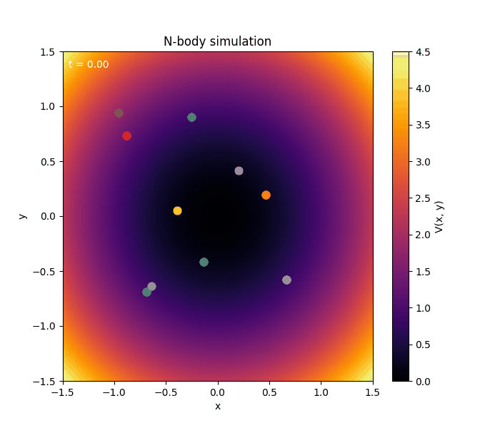

# N-body-Euler
This is a 2D, N body, Euler's method based simulation of non-interacting particles in a background potential. The particle positions are initially random. Parameters such as number of particles, the mass of each particle, the time step, and the total simulation time, can all be adjusted in main.cpp. Here's an example where 10 particles are placed in a harmonic potential:

  

To compile the C++ code which generates the simulation data, use:
g++ src/main.cpp -o build/nbody (Linux/Mac)

To run the C++ executable, enter: ./build/nbody (Linux/Mac)

Now there should be potential.csv and states.csv files in the outputs folder. Run create_animation.py to generate an animation of the simulation. The animation file will also be placed in the outputs folder.
